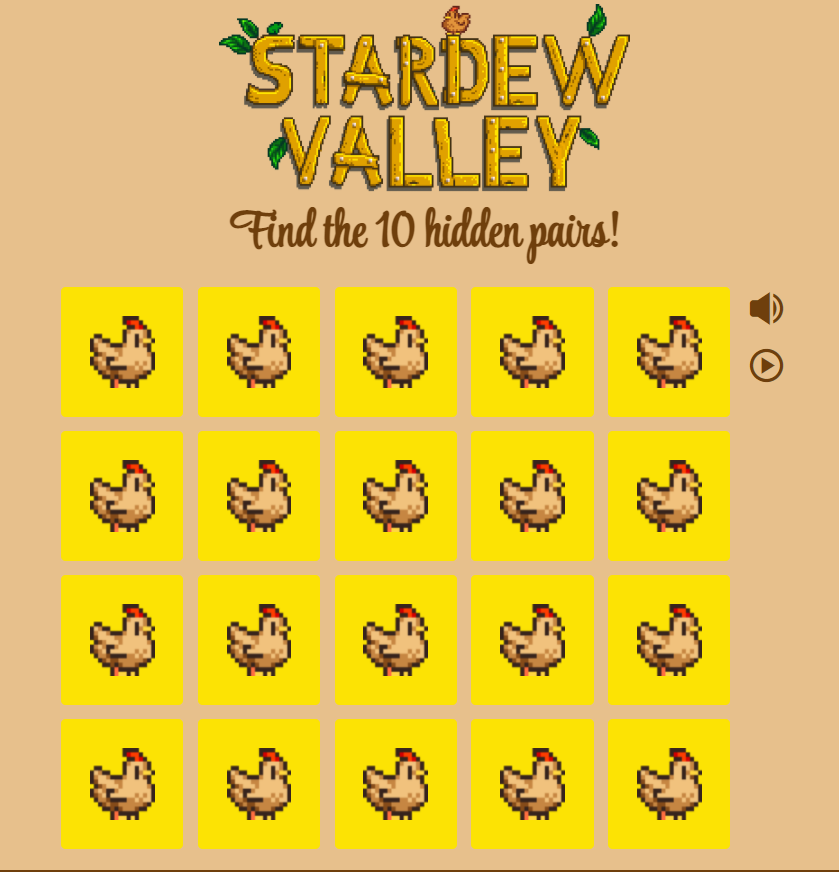

<!DOCTYPE html>

    <html lang="es">
    <head>
        <meta charset="utf-8">
        <meta name="viewport" content="width=device-width, initial-scale=1, shrink-to-fit=no"/>

        <link href='https://unpkg.com/boxicons@2.0.9/css/boxicons.min.css' rel='stylesheet'>
        <link rel="stylesheet" href="https://cdnjs.cloudflare.com/ajax/libs/animate.css/4.1.1/animate.min.css"/>
        <link rel="stylesheet" href="css/swiper-bundle.min.css">

        <link rel="stylesheet" href="css/style.css">

        <title>Joaquin Javier Pastore Barrios - Web & App Developer</title>

    </head>
    <body>

        <header class="header" id="header">
            <nav class="nav container">
                <a href="#" class="nav_logo">Joaquin</a>
                

                    <ul class="nav_list grid">
                        <li class="nav_item">
                            <a href="#home" class="nav_link active-link">
                                <i class='bx bx-home-alt nav_icon'></i> Inicio
                            </a>
                        </li>
                        <li class="nav_item">
                            <a href="#about" class="nav_link">
                                <i class='bx bx-user nav_icon'></i> Perfil
                            </a>
                        </li>
                        <li class="nav_item">
                            <a href="#skills" class="nav_link">
                                <i class='bx bx-file nav_icon'></i> Habilidades
                            </a>
                        </li>
                        <li class="nav_item">
                            <a href="#studies" class="nav_link">
                                <i class='bx bx-book-bookmark nav_icon'></i> Estudios
                            </a>
                        </li>
                        <li class="nav_item">
                            <a href="#portfolio" class="nav_link">
                                <i class='bx bxs-image nav_icon'></i> Portfolio
                            </a>
                        </li>
                        <li class="nav_item">
                            <a href="#contact" class="nav_link">
                                <i class='bx bx-message-alt-detail nav_icon'></i> Contacto
                            </a>
                        </li>
                    </ul>
                    <i class='bx bx-x nav_close' id="nav-close"></i>
                

                

                    <i class='bx bx-moon change_theme' id="theme-button"></i>
                    

                        <i class='bx bx-grid-alt'></i>
                    

                

            </nav>
        </header>

        <main class="main">

            <section class="home section" id="home">
                

                    

                        

                            <a href="https://www.linkedin.com" target="_blank" class="home_social-icon">
                                <i class='bx bxl-linkedin-square'></i>
                            </a>
                            <a href="https://www.github.com/JoaquinJPB" target="_blank" class="home_social-icon">
                                <i class='bx bxl-github'></i>
                            </a>
                        

                        

                            <svg class="home_blob" viewBox="0 0 200 187" xmlns="http://www.w3.org/2000/svg" xmlns:xlink="http://www.w3.org/1999/xlink">
                                <mask id="mask0" mask-type="alpha">
                                    <path d="M58.5,-17.3C67.6,8.8,60.9,41.7,38.9,58.9C16.9,76.1,-20.3,77.7,
                                    -38.6,62.2C-56.9,46.8,-56.3,14.3,-46.7,-12.5C-37.1,-39.4,-18.6,-60.7,3.1,
                                    -61.8C24.8,-62.8,49.5,-43.4,58.5,-17.3Z" transform="translate(100 100)"/>
                                </mask>
                                <g mask="url(#mask0)">
                                    <path d="M58.5,-17.3C67.6,8.8,60.9,41.7,38.9,58.9C16.9,76.1,-20.3,77.7,
                                    -38.6,62.2C-56.9,46.8,-56.3,14.3,-46.7,-12.5C-37.1,-39.4,-18.6,-60.7,3.1,
                                    -61.8C24.8,-62.8,49.5,-43.4,58.5,-17.3Z" transform="translate(100 100)"/>
                                    <image class="home_blob-img" x="60" y="60" xlink:href="images/perfil_2.png"/>
                                </g>
                            </svg>
                        

                        

                            <h1 class="home_title wow animate__animated animate__slideInLeft">!Hey, soy Joaquin!</h1>
                            <h3 class="home_subtitle">Web & App Developer</h3>
                            
Actualmente soy estudiante de la Universidad, y mientras estudio, me intereso por los temas más actuales del mundo de la tecnología.

                            <a href="#contact" class="button button--flex">
                                Contacto <i class='bx bxs-user-circle button_icon'></i>
                            </a>
                        

                    

                    

                        <a href="#about" class="home_scroll-button button--flex">
                            <i class='bx bx-mouse home_scroll-mouse'></i>
                            Mas info
                            <i class='bx bx-down-arrow-alt home_scroll-arrow'></i>
                        </a>
                    

                

            </section>

            <section class="about section" id="about">
                <h2 class="section_title">Mi Perfil</h2>
                Introducción

                

                    
                    

                        
Suelo desarrollar mis propios proyectos para aprender más y adquirir muchos más conocimientos.
                            Ahora mismo estoy muy interesado en el desarrollo web. Pero, siempre estoy dispuesto a trabajar y aprender en cualquier proyecto.

                        

                            

                                +3
                                Proyectos   completados
                            

                            

                                
                                Edad
                            

                        

                        

                            <a href="CV.pdf" class="button button--flex" download="CV_Joaquin">
                                Descargar CV <i class='bx bx-download button_icon'></i>
                            </a>
                        

                    

                

            </section>

            <section class="skills section" id="skills">
                <h2 class="section_title">Habilidades</h2>
                Mi desarrollo personal

                

                    

                        

                            

                                <i class='bx bx-code-block skills_icon'></i>
                                

                                    <h1 class="skills_title">Frontend Developer</h1>
                                    Más de 3 años
                                

                                <i class='bx bx-chevron-down bx-flip-horizontal skills_arrow' ></i>
                            

                            

                                

                                    

                                        

                                            <h3 class="skills_name">HTML</h3>
                                            <i class='bx bxl-html5 skills_icon_row'></i>
                                        

                                        90%
                                    

                                    

                                        
                                    

                                

                                

                                    

                                        

                                            <h3 class="skills_name">CSS</h3>
                                            <i class='bx bxl-css3 skills_icon_row'></i>
                                        

                                        70%
                                    

                                    

                                        
                                    

                                

                                

                                    

                                        

                                            <h3 class="skills_name">JavaScript</h3>
                                            <i class='bx bxl-javascript skills_icon_row'></i>
                                        

                                        60%
                                    

                                    

                                        
                                    

                                

                                

                                    

                                        

                                            <h3 class="skills_name">React</h3>
                                            <i class='bx bxl-react skills_icon_row'></i>
                                        

                                        20%
                                    

                                    

                                        
                                    

                                

                            

                        

                        

                            

                                <i class='bx bxs-server skills_icon'></i>
                                

                                    <h1 class="skills_title">Backend Developer</h1>
                                    Más de 2 años
                                

                                <i class='bx bx-chevron-down bx-flip-horizontal skills_arrow'></i>
                            

                            

                                

                                    

                                        

                                            <h3 class="skills_name">PHP</h3>
                                            <i class='bx bxl-php skills_icon_row'></i>
                                        

                                        60%
                                    

                                    

                                        
                                    

                                

                                

                                    

                                        

                                            <h3 class="skills_name">Node Js</h3>
                                            <i class='bx bxl-nodejs skills_icon_row'></i>
                                        

                                        20%
                                    

                                    

                                        
                                    

                                

                                

                                    

                                        

                                            <h3 class="skills_name">Firebase</h3>
                                            <i class='bx bxl-firebase skills_icon_row' ></i>
                                        

                                        30%
                                    

                                    

                                        
                                    

                                

                                

                                    

                                        

                                            <h3 class="skills_name">Python</h3>
                                            <i class='bx bxl-python skills_icon_row'></i>
                                        

                                        35%
                                    

                                    

                                        
                                    

                                

                            

                        

                    

                

            </section>

            <section class="qualification section" id="studies">
                <h2 class="section_title">Estudios</h2>
                Mi viaje personal

                

                    

                        

                            <i class='bx bxs-graduation qualification_icon'></i>
                            Educación
                        

                        

                            <i class='bx bxs-briefcase qualification_icon'></i>
                            Trabajo
                        

                    

                    

                        

                            

                                

                                    <h3 class="qualification_title">Bachillerato Tecnológico</h3>
                                    España - IES Alonso Quesada
                                    

                                        <i class='bx bxs-calendar'></i>
                                        2016-2018
                                    

                                

                                

                                    
                                    
                                

                            

                            

                                

                                

                                    
                                    
                                

                                

                                    <h3 class="qualification_title">Grado en Ingeniería Informática</h3>
                                    España - Universidad de las Palmas de G.C
                                    

                                        <i class='bx bxs-calendar'></i>
                                        2018-2022
                                    

                                

                            

                        

                        

                            

                                

                                    <h3 class="qualification_title">Prácticas Externas</h3>
                                    Sic4Change
                                    

                                        <i class='bx bxs-calendar'></i>
                                        2021-2022
                                    

                                

                                

                                    
                                    
                                

                        

                    

                

            </section>

            <section class="portfolio section" id="portfolio">
                <h2 class="section_title">Portfolio</h2>
                Mis proyectos más recientes

                

                    

                        

                            

                            

                                <h3 class="portfolio_title">To-Do List</h3>
                                
Proyecto desarrollado mediante JavaScript & NodeJS para crear un listado de tareas pendientes que puede ayudarte a gestionar el día a día.

                                <a href="https://github.com/JoaquinJPB/JSTodoList" class="button button--flex button--small portfolio_button" target="_blank">
                                    Github
                                    <i class='bx bxl-github'></i>
                                    <i class='bx bx-right-arrow-alt button_icon'></i>
                                </a>
                            

                        

                        

                            

                            

                                <h3 class="portfolio_title">Reconocimiento de imagenes mediante inteligencia artificial</h3>
                                
Proyecto desarrollado con Python, para permitir clasificar imagenes mediante inteligencia artificial.

                                <a href="https://github.com/JoaquinJPB/AI-ImageRecognition" class="button button--flex button--small portfolio_button" target="_blank">
                                    Github
                                    <i class='bx bxl-github'></i>
                                    <i class='bx bx-right-arrow-alt button_icon'></i>
                                </a>
                            

                        

                        

                            

                            

                                <h3 class="portfolio_title">Stardew Valley: Juego de Memoria</h3>
                                
Proyecto desarrollado en JavaScript Vanilla, para crear un juego de memoria inspirado en el famoso juego Stardew Valley.

                                <a href="https://joaquinjpb.github.io/Stardew-Valley-memory-game/" class="button button--flex button--small portfolio_button" target="_blank">
                                    Sitio Web
                                    <i class='bx bx-right-arrow-alt button_icon'></i>
                                </a>
                            

                        

                    

                    

                        <i class='bx bx-chevron-right swiper-portfolio-icon'></i>
                    

                    

                        <i class='bx bx-chevron-left swiper-portfolio-icon'></i>
                    

                    

                

            </section>

            <section class="contact section" id="contact">
                <h2 class="section_title">Contacto</h2>
                !Caminemos al exito!

                

                    

                        

                            <i class='bx bxs-envelope contact_icon'></i>
                            

                                <h3 class="contact_title">Email</h3>
                                pastorebarriosjoaquin@gmail.com
                            

                        

                        

                            <i class='bx bxs-map contact_icon'></i>
                            

                                <h3 class="contact_title">Localización</h3>
                                España - Gran Canaria, Las Palmas de G.C
                            

                        

                    

                    <form action="" class="contact_form grid">
                        

                            

                                <label for="" class="contact_label">Nombre</label>
                                <input type="text" class="contact_input">
                            

                            

                                <label for="" class="contact_label">Email</label>
                                <input type="email" class="contact_input">
                            

                        

                        

                            <label for="" class="contact_label">Proyecto</label>
                            <input type="text" class="contact_input">
                        

                        

                            <label for="" class="contact_label">Mensaje</label>
                            <textarea name="" id="" cols="0" rows="7" class="contact_input"></textarea>
                        

                        

                            <a href="#" class="button button--flex">
                                Enviar Mensaje
                                <i class='bx bxs-send button_icon'></i>
                            </a>
                        

                    </form>
                

            </section>

        </main>

        <footer class="footer">
            

                

                    

                        <h1 class="footer_title">Joaquin</h1>
                        Frontend Developer
                    

                    <ul class="footer_links">
                        <li>
                            <a href="#skills" class="footer_link">Habilidades</a>
                        </li>
                        <li>
                            <a href="#portfolio" class="footer_link">Portfolio</a>
                        </li>
                        <li>
                            <a href="#contact" class="footer_link">Contacto</a>
                        </li>
                    </ul>

                    

                        <a href="https://twitter.com/JoaquiinPB" target="_blank" class="footer_social">
                            <i class='bx bxl-twitter'></i>
                        </a>
                        <a href="https://www.instagram.com/joaquiinpastore/" target="_blank" class="footer_social">
                            <i class='bx bxl-instagram-alt'></i>
                        </a>
                    

                

                
&#169; Joaquin Javier Pastore Barrios

            

        </footer>

        <a href="#" class="scrollup" id="scroll-up">
            <i class='bx bx-up-arrow-alt scrollup_icon'></i>
        </a>

        
        
        
        
        

    </body>
    </html>
